# GA Project 3 - Instasham

# Contents
- [Description](#description)
- [Technology used](#technologies-used)
- [Project brief](#brief)
- [Planning](#planning)
- [Build process](#build-process)
- [Challenges](#challenges)
- [Wins](#wins)
- [Key learnings](#key-learnings)
- [Bugs](#bugs)
- [Future improvements](#future-improvements)

# Description

The aim of this project was to build a full stack MERN app of our choice in a group of three.

# Deployment link

https://instasham.herokuapp.com/

# Getting Started/Code Installation

After cloning the project, run npm install in both the ‘Insta’ folder and the ‘client’ folder. 
Once dependencies are installed, in the terminal run ‘npm run seed’ in the ‘Insta’ folder, and after seeds are added run ‘npm run serve’ to start the server. Then in a second terminal window, in the ‘client’ folder run ‘npm run start’ to launch the app. You can then enjoy the app from your browser at ‘localhost:3000’ 😊

# Timeframe & Working Team (Solo/Pair/Group)

Timeframe: 1.5 weeks 
This was a group project with Matea Nikolac and James Nellist.

# Technologies Used

React, Node, Express, MongoDB, Mongoose, JSX, SASS, Insomnia, Excalidraw.

# Brief

- Build a full-stack application by making your own backend and your own front-end
- Use an Express API to serve your data from a Mongo database
- Consume your API with a separate front-end built with React
- Be a complete product which most likely means multiple relationships and CRUD functionality for at least a couple of models
- Implement thoughtful user stories/wireframes that are significant enough to help you know which features are core MVP and which - you can cut
- Have a visually impressive design

# Planning

We started this project by brainstorming ideas for our app and planning in detail how we wanted to create it. We decided on a social media app, and then drew up a wireframe of how we wanted it to look. This also included an ERD so that we were clear on what the relationships were between different backend components.
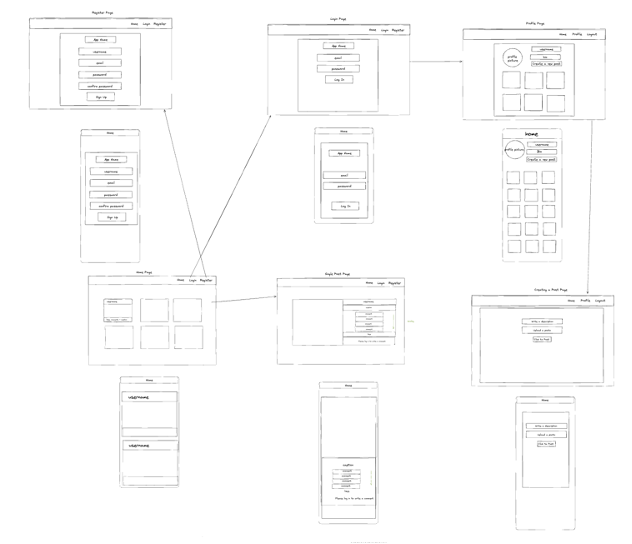
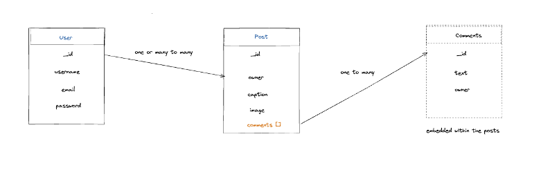

Following this, we created a Trello board so that we would be able to visualise all tasks, delegate fairly, minimise merge conflicts, and hop in to help one another when needed. Our Trello board included an “All Todos” column, where all tasks could be dumped while brainstorming; a separate column for each team member where all tasks assigned to that person would be placed; an “in progress” column so we could see clearly who is working on what at any given time; and “Done - testing needed” and “Done - tested” columns for finished tasks.
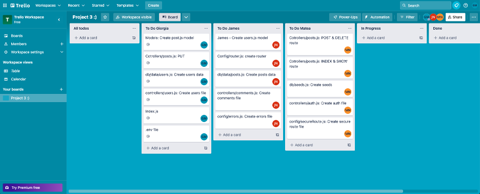

For the first day we split up backend tasks by figuring out together what all possible backend tasks would be and making tickets for each one in the “All Todos” column, and then dividing these tickets up between team members. With this system we managed to complete the backend on Day One! 
On the second day we followed the same process for front end tasks.
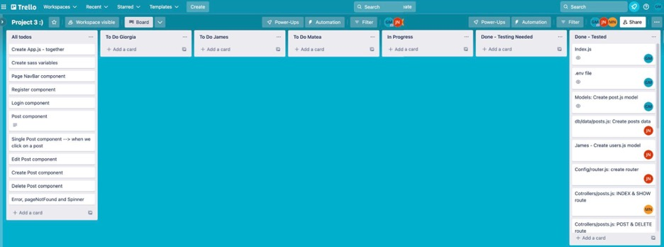

# Build Process

Throughout the project, tasks I completed included:  
- Backend: Setting up index.js server and .env file, creating the post.js model, making the PUT route and controller for posts.js, creating seeds for user profiles, creating all the GET and PUT routes and controllers needed for users (getting profile view, getting and editing profile picture and bio, and getting other users’ profiles)
- Frontend: Components: Register, DisplayPosts, CreatePost, ProfilePage, EditProfile, Footer, OtherProfiles (for viewing other users’ profiles), EditBio, ChangePhoto (allows user to upload new profile photo), ImageUploadField and ProfileUpload for uploading post or profile photos with Cloudinary API
- Other: adding comments on the SinglePost component, displaying the most recent comment of a given post on the homepage, displaying bio on Profile pages, displaying profile photos where necessary (on profile page, homepage, and in comments). I also added the styling for the app.

I started by creating routes, models and controllers on the backend. These were quite quick to set up. I tested all routes in Insomnia as I worked, and I also made sure to populate fields as necessary, such as ‘posts’ and ‘owner’ as shown below.
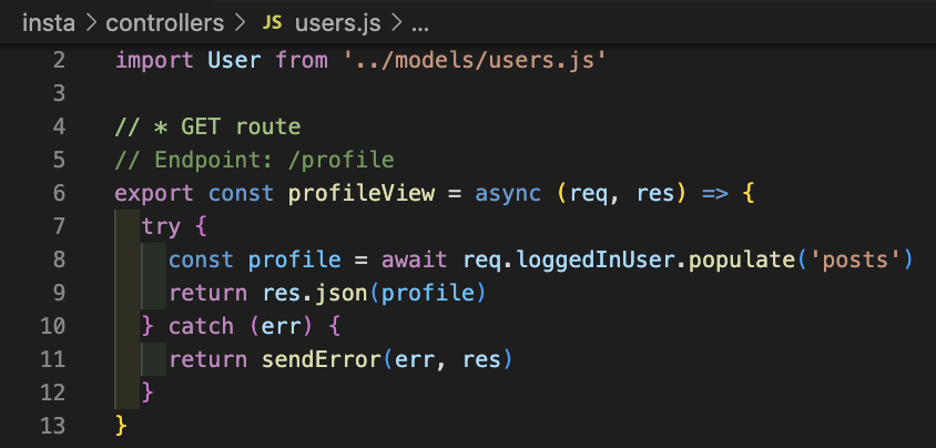
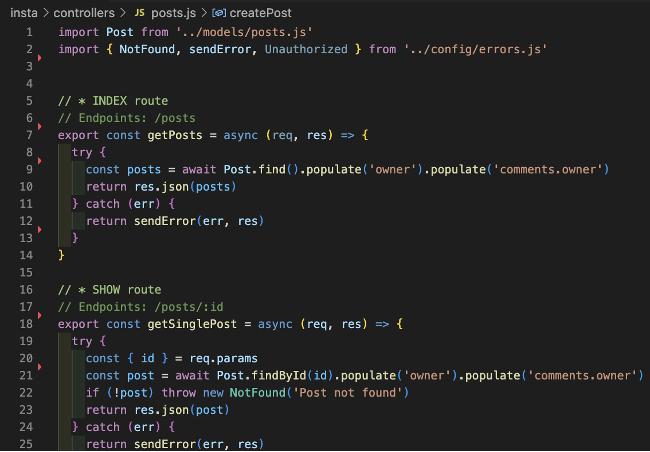

Once it was time to tackle the frontend, I started by creating basic components.

I realised that posts would need to be displayed differently on different pages, sometimes showing all related information including owner of the post and caption like on the homepage, and sometimes only the image such as on the profile page. For this reason I decided to create a DisplayPost component where all information would be passed down as props, and that way I have control over what is displayed each time the component is used:
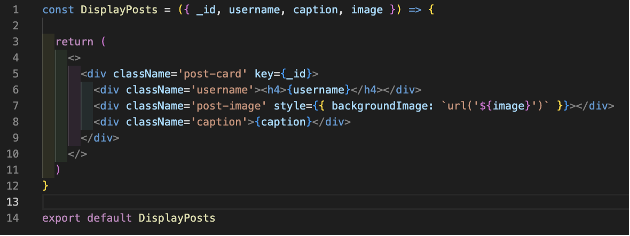

With this, on the homepage I displayed all information related to each post:
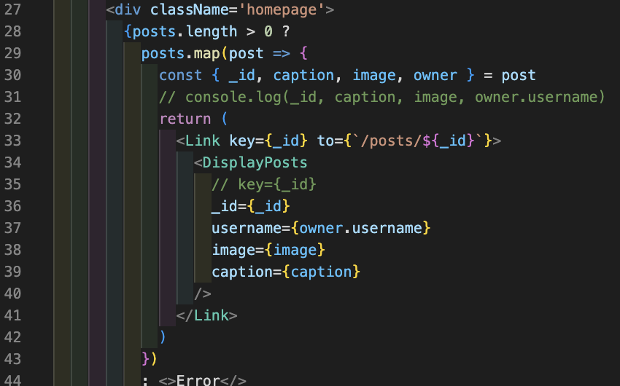

And on the profile page I only displayed the image so that the layout was beautifully minimal:
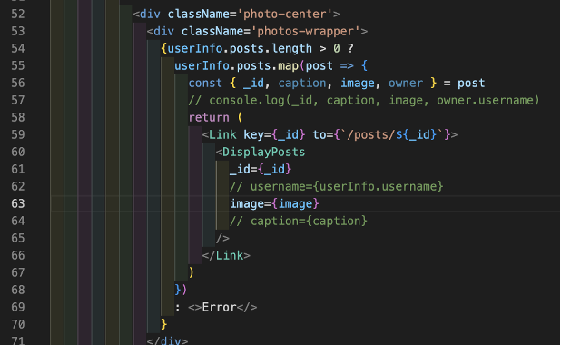

I noticed that when displaying comments on the homepage, the comment itself and the date it was created would display however the owner of the comment was not being pulled. This was a simple fix - I just added populate(‘comments.owner’) to the find() query in the GetPosts function in controllers/posts.js:
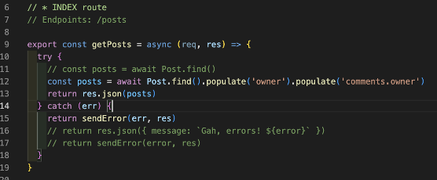

I created conditional links to the Profile page so that if the user is logged in, they will be taken to their own profile page (which includes buttons such as ‘create post’), otherwise they will be taken to another user’s profile page which does not have those buttons. This involved also editing the DisplayPosts component to accept a link as props:
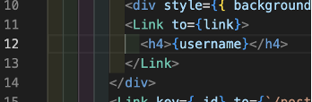

In Home.js the url is created via the ternary on line 58 and passed into the component on line 66:
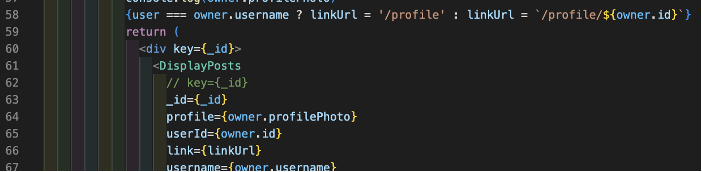

In SinglePost.js component the link url was set in state (lines 54-60) and passed in on line 118:
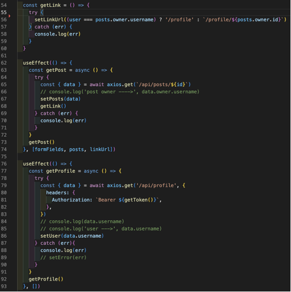
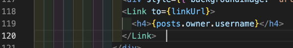

I decided to add profilePhoto to the schema so that I could display a user’s profile photo on the homepage, profile page, and in the comments, and I also made it possible for a user to upload a new profile photo using Cloudinary:
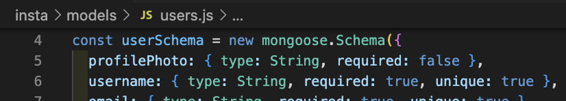
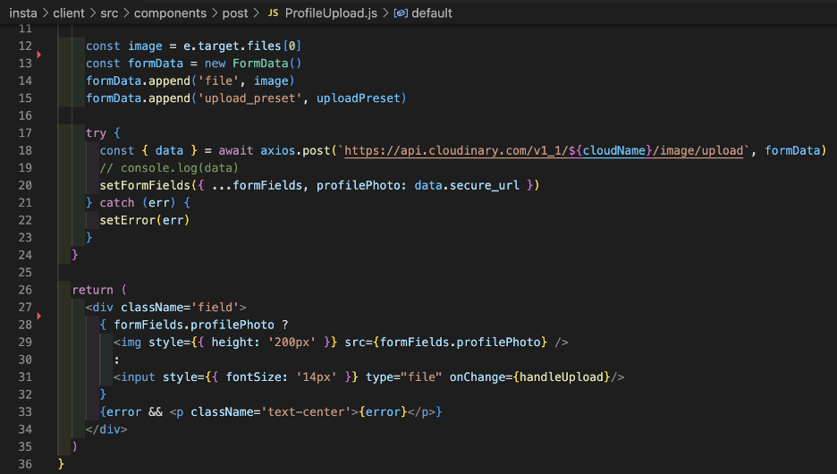

There was also still time left to polish up some details, so I made the comment bar become empty after submitting a comment, prevented inputs from zooming on mobile, made the navbar auto-close and edited navbar styles such as text alignment, and made the user bio editable.

# Challenges
Thanks to brilliant team work and everyone supporting each other, this project didn't feel challenging! It couldn’t have gone more smoothly :)

# Wins

- Teamwork was incredible! I feel very lucky to have been part of such a hardworking, friendly, passionate team. The Trello was also vital to such a smooth outcome.
- Beautiful, clean design. I believe the final design looks like a real social media app and that space was used wisely given that we have less features than Instagram.

# Key Learnings

- We held standups every morning which was a great habit - we were able to cheer each other on by continuously celebrating each others’ wins, and to brainstorm continuously as needed, whether that was a bug someone noticed or a new feature that could be added
- Using Trello to track where everyone was at was fantastic and allowed us to stay in the loop without the need for excessive meetings. It also helped keep the workload fair - if someone finished their tickets they could offer to take one from someone else, and as new tickets continued to be added we were able to split these quickly and fairly
- Saving pair-programming only for sticking points was a brilliant time-saver and meant that the majority of our time was spent attacking tickets. This definitely boosted our productivity!
- I am also a lot more comfortable now with building and using my own API with MVC architecture, as well as with using JWT for authentication

# Bugs

I don’t think we have any bugs left… We were very attentive to bugs while building and squashed lots of bugs throughout the week :)

# Future Improvements

- Change Navbar text to icons [see updates below]
- Allow user to edit and delete comments
- Add a Like button
- Possibly order home feed by number of likes (although I might prefer our current newest-first order - perhaps a combination of - the two?)
- Location detector for photo uploads

[Updates]  
- Improved navbar by adding icons and profile image, and made navbar stick to bottom on mobile
